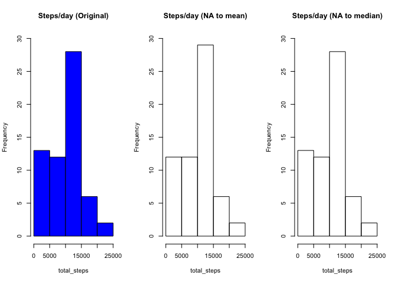

```r
setwd("~/GitHub/datasciencecoursera/Course5/RepData_PeerAssessment1")
library(dplyr)
```

```
## 
## Attaching package: 'dplyr'
```

```
## The following objects are masked from 'package:stats':
## 
##     filter, lag
```

```
## The following objects are masked from 'package:base':
## 
##     intersect, setdiff, setequal, union
```

```r
library(ggplot2)
```

## Loading and preprocessing the data

```r
readLines("activity.csv", n=5)
```

```
## [1] "\"steps\",\"date\",\"interval\"" "NA,\"2012-10-01\",0"            
## [3] "NA,\"2012-10-01\",5"             "NA,\"2012-10-01\",10"           
## [5] "NA,\"2012-10-01\",15"
```

When viewing the first few lines of the raw data, you see that activity.csv includes a header with three columns (steps, date, interval), dates are strings in the form year-month-day (%Y-%m-%d) and missing values are tracked as NA. Set header to true to preserve column names.


```r
## Read
activity <- read.csv("activity.csv", header=TRUE)
str(activity)
```

```
## 'data.frame':	17568 obs. of  3 variables:
##  $ steps   : int  NA NA NA NA NA NA NA NA NA NA ...
##  $ date    : Factor w/ 61 levels "2012-10-01","2012-10-02",..: 1 1 1 1 1 1 1 1 1 1 ...
##  $ interval: int  0 5 10 15 20 25 30 35 40 45 ...
```

To be able to organize data by time intervals such as day or month, convert the character representation of date to date class.


```r
## Convert characters to date
activity <- transform(activity, date=as.Date(date))
str(activity)
```

```
## 'data.frame':	17568 obs. of  3 variables:
##  $ steps   : int  NA NA NA NA NA NA NA NA NA NA ...
##  $ date    : Date, format: "2012-10-01" "2012-10-01" ...
##  $ interval: int  0 5 10 15 20 25 30 35 40 45 ...
```

## What is mean total number of steps taken per day?
Some intervals and days display NA values for steps. For this part of the assignment, you can ignore the missing values in the dataset.

Use the total steps per day to create the histogram of the total steps taken per day.


```r
SummarySteps <- select (activity, date, steps) %>%
    group_by(date) %>%
    summarise(total_steps=sum(steps, na.rm = TRUE))

with (SummarySteps, hist(total_steps, 
                         main="Histogram of Steps per day",
                         xlab = "Total Steps each Day"))
```

<!-- -->

Calculate the mean and median of the total number of steps taken per day. 


```r
MeanAndMedian <- summarise(SummarySteps, 
                           mean_steps=mean(total_steps),
                           median_steps=median(total_steps))

print(MeanAndMedian)
```

```
## # A tibble: 1 x 2
##   mean_steps median_steps
##        <dbl>        <int>
## 1      9354.        10395
```

## What is the average daily activity pattern?
Make a time series plot (i.e.type="l") of the 5-minute interval (x-axis) and the average number of steps taken, averaged across all days (y-axis).


```r
SummaryInterval <- activity %>%
    group_by(interval) %>%
    summarise(mean_steps=mean(steps, na.rm=TRUE),
              median_steps=median(steps, na.rm=TRUE))

with(SummaryInterval, 
     plot(interval, mean_steps, type="l", 
          main = "Average Daily Activity Pattern"))
```

<!-- -->
Which 5-minute interval, on average across all the days in the dataset, contains the maximum number of steps?


```r
WhichInterval <- which.max(SummaryInterval$mean_steps)
```

Interval 104 contains the maximum number of steps. 

## Imputing missing values

As mentioned earlier, there are a number of days/intervals where there are missing values coded as NA). The presence of missing days may introduce bias into some calculations or summaries of the data.

Checking the summary for activity, it appears that just steps has NA values.


```r
summary(activity)
```

```
##      steps             date               interval     
##  Min.   :  0.00   Min.   :2012-10-01   Min.   :   0.0  
##  1st Qu.:  0.00   1st Qu.:2012-10-16   1st Qu.: 588.8  
##  Median :  0.00   Median :2012-10-31   Median :1177.5  
##  Mean   : 37.38   Mean   :2012-10-31   Mean   :1177.5  
##  3rd Qu.: 12.00   3rd Qu.:2012-11-15   3rd Qu.:1766.2  
##  Max.   :806.00   Max.   :2012-11-30   Max.   :2355.0  
##  NA's   :2304
```

Total number of rows with missing values is 2304.

Since there are some days with no data, fill in missing data with the mean steps for the given interval. Doing this is not the most highly recommended (based on a quick scan of https://github.com/lgreski/datasciencectacontent/blob/master/markdown/gen-handlingMissingValues.md), but it is simple. Curious, also try filling missing data with the median steps for the given interval.

Create a new dataset that is equal to the original dataset but with the missing data replaced by the mean (or median) for the given interval.


```r
## Fill with mean
activityNoNA_mean <- activity %>% 
    mutate(steps = ifelse(is.na(steps),
                SummaryInterval$mean_steps[
                    SummaryInterval$interval==activity$interval],steps))

## Fill with median
activityNoNA_median <- activity %>% 
    mutate(steps = ifelse(is.na(steps),
                SummaryInterval$median_steps[
                    SummaryInterval$interval==activity$interval],steps))
```

Make a histogram of the total number of steps taken each day. Recalculate the number of steps per day, first.


```r
## summarize NA replaced by mean
SummaryStepsNoNA_mean <- select (activityNoNA_mean, date, steps) %>%
    group_by(date) %>%
    summarise(total_steps=sum(steps, na.rm = TRUE))

## summarize NA replaced by median
SummaryStepsNoNA_median <- select (activityNoNA_median, date, steps) %>%
    group_by(date) %>%
    summarise(total_steps=sum(steps, na.rm = TRUE))

# print histograms side by side for comparison
par(mfrow=c(1,3))

with (SummarySteps, hist(total_steps, 
                         ylim = c(0,30),
                         main="Steps per day"))

with (SummaryStepsNoNA_mean, hist(total_steps, 
                                  ylim = c(0,30),
                                  main="Steps/day (NA to mean)"))

with (SummaryStepsNoNA_median, hist(total_steps, 
                                    ylim = c(0,30),
                                    main="Steps/day (NA to median)"))
```

<!-- -->

Calculate and report the mean and median total number of steps taken per day. 

```r
MeanAndMedianNoNA_mean <- summarise(SummaryStepsNoNA_mean, 
                           mean_steps=mean(total_steps),
                           median_steps=median(total_steps))
MeanAndMedianNoNA_median <- summarise(SummaryStepsNoNA_median, 
                           mean_steps=mean(total_steps),
                           median_steps=median(total_steps))

print(MeanAndMedianNoNA_mean)
```

```
## # A tibble: 1 x 2
##   mean_steps median_steps
##        <dbl>        <dbl>
## 1      9531.        10439
```

```r
print(MeanAndMedianNoNA_median)
```

```
## # A tibble: 1 x 2
##   mean_steps median_steps
##        <dbl>        <int>
## 1      9373.        10395
```

```r
print(MeanAndMedian)
```

```
## # A tibble: 1 x 2
##   mean_steps median_steps
##        <dbl>        <int>
## 1      9354.        10395
```
In both cases, replacing NAs with the mean or median results in new data sets with higher means. Replacing NAs with the mean also increased the resulting median. Hovever, replacing the NAs with the median had no change on the median of the new data set.

Imputing missing data using the mean seems to have had a more pronounced impact on the data in the lower step count range. However, based on the shape of the histogram, imputing with the median had less impact.

## Are there differences in activity patterns between weekdays and weekends?

Use weekdays() to create a new factor variable in the dataset with two levels – “weekday” and “weekend” indicating whether a given date is a weekday or weekend day.


```r
Weekend <- c("Sat","Sun")
# weekday or weekend?
activityByDay <- activityNoNA_median %>% 
     mutate(the_week = ifelse((weekdays(date,abbreviate=TRUE) %in% Weekend),
                              "weekend","weekday"))

## Make Factor, define levels so that "weekend"" appears on top panel
activityByDay$the_week <- factor(activityByDay$the_week, levels = c("weekend","weekday"))

## Double check
str(activityByDay)
```

```
## 'data.frame':	17568 obs. of  4 variables:
##  $ steps   : int  0 0 0 0 0 0 0 0 0 0 ...
##  $ date    : Date, format: "2012-10-01" "2012-10-01" ...
##  $ interval: int  0 5 10 15 20 25 30 35 40 45 ...
##  $ the_week: Factor w/ 2 levels "weekend","weekday": 2 2 2 2 2 2 2 2 2 2 ...
```

Make a panel plot containing a time series plot (i.e. type = "l") of the 5-minute interval (x-axis) and the average number of steps taken, averaged across all weekday days or weekend days (y-axis).  

```r
SummaryByDay <- activityByDay %>%
    group_by(the_week, interval) %>%
    summarise(total_steps=sum(steps, na.rm=TRUE))

g = qplot(interval, total_steps, data =SummaryByDay, 
          geom="path", xlab = "Interval", ylab="Number of Steps")
g + facet_wrap(~ the_week, nrow=2)
```

<!-- -->

From the graphs, you can see that the subject was more active during the week than on the weekend.  On the weekend the subject did not exceed 2500 steps per interval.  Weekdays saw several step counts well over 2500 over the course of the day.

## MISC
In case of MacEmergency, review:
https://github.com/lgreski/datasciencectacontent/blob/master/markdown/repData-configuringKnitrWithMarkdownOutput.md
